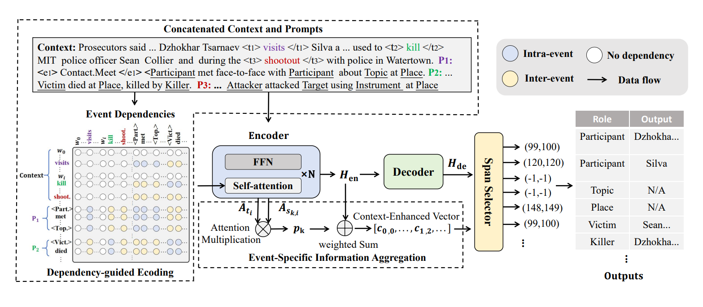

# DEEIA


Source code for Findings of ACL 2024 paper: [Beyond Single-Event Extraction: Towards Efficient Document-Level Multi-Event Argument Extraction](https://aclanthology.org/2024.findings-acl.564).

 Our code is based on PAIE [here](https://github.com/mayubo2333/PAIE) and thanks for their implement.

## 🔥 Introduction

Recent mainstream event argument extraction methods process each event in isolation, resulting in inefficient inference and ignoring the correlations among multiple events. To address these limitations, here we propose a multiple-event argument extraction model DEEIA (Dependency-guided Encoding and Event-specific Information Aggregation), capable of extracting arguments from all events within a document simultaneously. The proposed DEEIA model employs a multi-event prompt mechanism, comprising DE and EIA modules. The DE module is designed to improve the correlation between prompts and their corresponding event contexts, whereas the EIA module provides event-specific information to improve contextual understanding. Extensive experiments show that our method achieves new state-of-the-art performance on four public datasets (RAMS, WikiEvents, MLEE, and ACE05), while significantly saving the inference time compared to the baselines. Further analyses demonstrate the effectiveness of the proposed modules.

You can refer to our [paper](https://aclanthology.org/2024.findings-acl.564) for more details.

<div align=center>

</div>

## 🚀 How to use our code?

# Project Title

This project provides the implementation of **DEEIA**, with support for dataset processing, training, and evaluation.

## 1. Setup Environment

Before starting, ensure you have the required dependencies and environment set up.

### 1.1 Create Conda Environment

First, create a new Conda environment with Python 3.9:

```bash
conda create -n DEEIA python=3.9
conda activate DEEIA
```

### 1.2 Install Dependencies

After activating the environment, install all necessary packages:

```bash
pip install -r requirements.txt
```

### 1.3 Install SpaCy Language Model

To enable language processing with SpaCy, download the `en_core_web_sm` model using the following command:

```bash
python -m spacy download en_core_web_sm
```

---

## 2. Data Preprocessing

You can refer to the **PAIE** project [here](https://github.com/mayubo2333/PAIE) to obtain the datasets. 

## 3. Training and Inference

The following scripts can be used to train and evaluate models on different datasets:

### 3.1 Training

You can train models by running the corresponding scripts:

```bash
bash ./scripts/train_wikievent_roberta.sh
bash ./scripts/train_rams_roberta.sh
bash ./scripts/train_mlee_roberta.sh
```

Each script is tailored to a specific dataset and configuration. You may modify the settings inside these scripts to suit your needs.


---

## 4. Contact

If you have any questions or need further assistance, feel free to reach out via:

**Email**: liuwanlong@std.uestc.edu.cn


## 🌝 Citation

If you use this work or code, please kindly cite the following paper:

```bib
@inproceedings{liu-etal-2024-beyond-single,
    title = "Beyond Single-Event Extraction: Towards Efficient Document-Level Multi-Event Argument Extraction",
    author = "Liu, Wanlong  and
      Zhou, Li  and
      Zeng, DingYi  and
      Xiao, Yichen  and
      Cheng, Shaohuan  and
      Zhang, Chen  and
      Lee, Grandee  and
      Zhang, Malu  and
      Chen, Wenyu",
    editor = "Ku, Lun-Wei  and
      Martins, Andre  and
      Srikumar, Vivek",
    booktitle = "Findings of the Association for Computational Linguistics ACL 2024",
    month = aug,
    year = "2024",
    address = "Bangkok, Thailand and virtual meeting",
    publisher = "Association for Computational Linguistics",
    url = "https://aclanthology.org/2024.findings-acl.564",
    doi = "10.18653/v1/2024.findings-acl.564",
    pages = "9470--9487",
    abstract = "Recent mainstream event argument extraction methods process each event in isolation, resulting in inefficient inference and ignoring the correlations among multiple events. To address these limitations, here we propose a multiple-event argument extraction model DEEIA (Dependency-guided Encoding and Event-specific Information Aggregation), capable of extracting arguments from all events within a document simultaneously. The proposed DEEIA model employs a multi-event prompt mechanism, comprising DE and EIA modules. The DE module is designed to improve the correlation between prompts and their corresponding event contexts, whereas the EIA module provides event-specific information to improve contextual understanding. Extensive experiments show that our method achieves new state-of-the-art performance on four public datasets (RAMS, WikiEvents, MLEE, and ACE05), while significantly saving the inference time compared to the baselines. Further analyses demonstrate the effectiveness of the proposed modules.",
}

```

